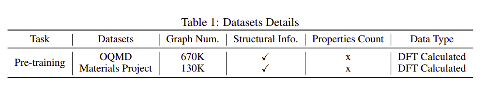

# crystal_untagged_800K

CrysGNN: Un-tagged Crystal Dataset (AAAI-2023). This repo contains 800K untagged crystal graph data introduced in [CrysGNN](https://kdmsit.github.io/assets/pdf/CrysGNN_Full.pdf) paper. 
In this paper, authors curated around 800K untagged crystal graph data from two popular materials databases, Materials Project (MP) and OQMD, to pre-train CrysGNN model. Details of the dataset is given below.




## How to cite

If you are using CrysGNN or this dataset, please cite our work as follow :

```
@article{
}
```
